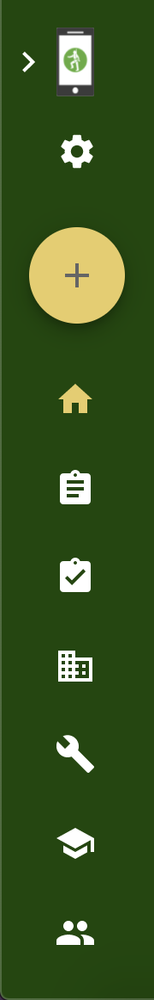
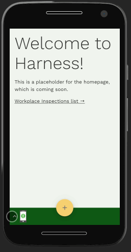
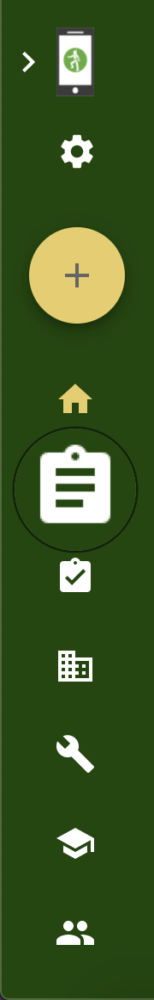
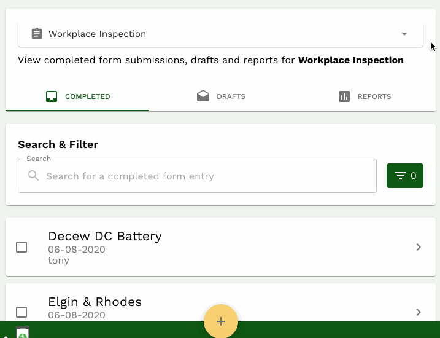
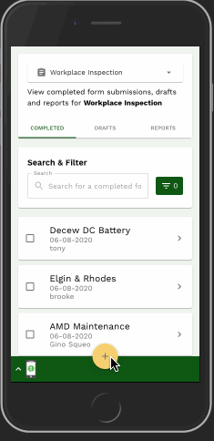
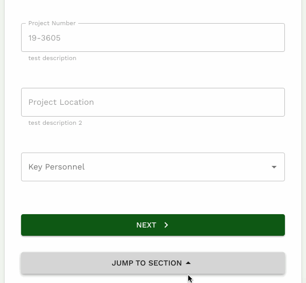
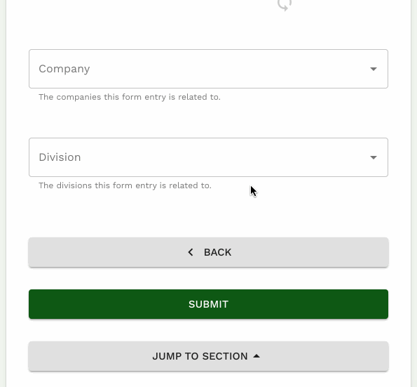

# Getting started with Harness V2

Harness is an app that works with any device that has a screen, including smartphones, tablets, and laptops, and desktop computers. We provide a platform for construction companies to better manage their health and safety program.

Getting up and running with Harness V2 is quick and easy. This document will walk you through the following:

1. Logging in to Harness
2. Navigating app pages and features
3. Accessing a form
4. Adding a new entry
5. Submitting a new form

## Logging in to Harness

When Harness first loads, you will be prompted to log in with your username or email address and your password. Enter your credentials and click the green log in button.

Once your username or email and password have been verified, you will be redirected to the homepage.

## Navigating app pages and features

After you have logged in to Harness, look for the green navigation bar to access different pages and features.

### Desktop

On a computer screen, you'll find the navigation bar on the left-hand side of the screen:

### Mobile

On a phone or tablet, you'll find the navigation bar at the bottom of the screen. Click on the up arrow and Harness logo on the bottom left corner to access the navigation bar.

## Accessing a form

One of the key features of Harness V2 is the ability to store any safety-related forms your company might need. These forms are fully customizable, and can include a wide range of information fields.

To fill out a new Workplace Inspection form, for example, first click the Forms icon in the navigation bar:

Once you are on the Forms page, select the form you want to work with from the dropdown menu near the top of the page:

The Search & Filter feature allows you to search by project name, project dates, and who submitted the form.

Entries of the form that fit your filter criteria will display below the Search & Filter bar.

## Adding a new entry

When you are ready to add a new entry, click on the yellow circle with the gray plus symbol on the navigation bar:

The fields marked with an asterisk (\*) are required.

Once you fill out the fields you need on a page, you can click on Next to go to the following page, or click on Jump To Section to see and navigate to all available sections of the form:

The Jump To Section feature comes with a search bar for when you need to find a specific section.

## Submitting a new form

Once you have filled out all the sections you need, click on the Submit button at the bottom of the last page of the form.

You will see a green pop-up window on the top right-hand corner of the screen that confirms your entry has been submitted.

All new entries are first saved as drafts, which can be found under the Drafts tab.

It can take a few minutes for the app to save your entry to the database and to display it on the Forms page. If you are offline when you click submit, the entry will be saved under the Drafts tab until you are connected to the internet.
