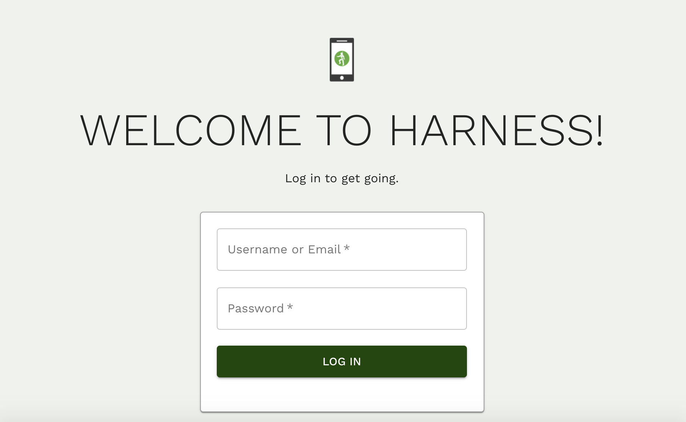

# Getting started with Harness V2

Harness is an app that works with any device that has a screen, including smartphones, tablets, and laptops, and desktop computers. We provide a platform for construction companies to better manage their health and safety program.

Getting up and running with Harness V2 is quick and easy. This document will walk you through how to:

1. Login to Harness
2. Navigate different pages and features
3. Fill out the Workplace Inspection form

Logging in to Harness

When Harness first loads, you will be prompted to log in, using either your email address or your username.

